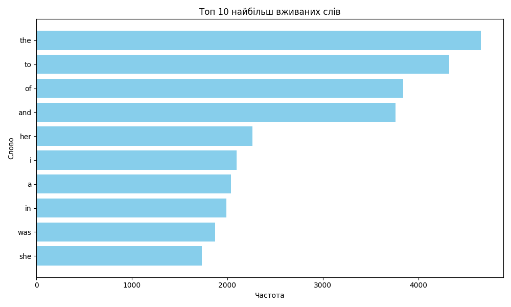

# goit-cs-hw-05
# Домашнє завдання до модуля “Асинхронна обробка”
## Це домашнє завдання складається з двох незалежних завдань, що охоплюють асинхронне програмування, роботу з файловою системою, паралельні обчислення за допомогою `MapReduce` та візуалізацію даних.

### Завдання 1: Асинхронне сортування файлів за розширенням
**Опис**
*Python-скрипт `sort_files.py` читає всі файли у вказаній користувачем вихідній папці (**source folder**) і розподіляє їх по підпапках у директорії призначення (**output folder**) на основі розширення файлів. Скрипт виконує сортування асинхронно для більш ефективної обробки великої кількості файлів.*

    python sort_files.py --source "source_data" --output "sorted_files"

### Завдання 2: Аналіз тексту та візуалізація за допомогою `MapReduce`
**Опис**
*Python-скрипт word_analyzer.py завантажує текст із заданої URL-адреси, аналізує частоту використання слів у тексті за допомогою парадигми `MapReduce` та візуалізує топ-слова з найвищою частотою використання.*

    python word_analyzer.py

------------

